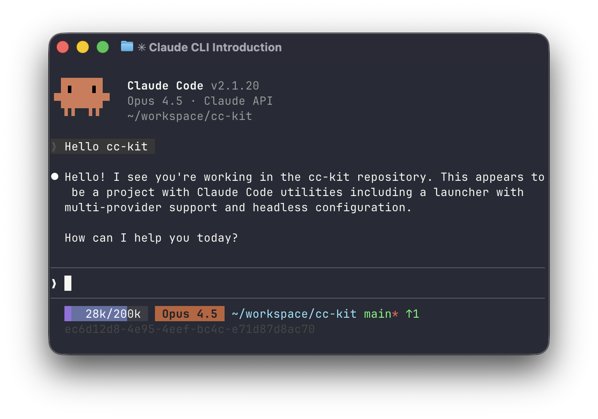

# cc-headless

Configuration for running Claude Code with API keys instead of the default subscription login.

Yolo mode is enabled via `permissions.defaultMode: "bypassPermissions"`.



## Setup

Copy the configuration files to your home directory:

```bash
cp -r .claude ~/
cp .claude.json ~/
```

## Authentication

```bash
# Anthropic API key
export ANTHROPIC_API_KEY="sk-ant-..."

# Or with custom endpoint
export ANTHROPIC_BASE_URL="https://api.example.com"
export ANTHROPIC_AUTH_TOKEN="your-token"
```

Then run `claude` as usual.
